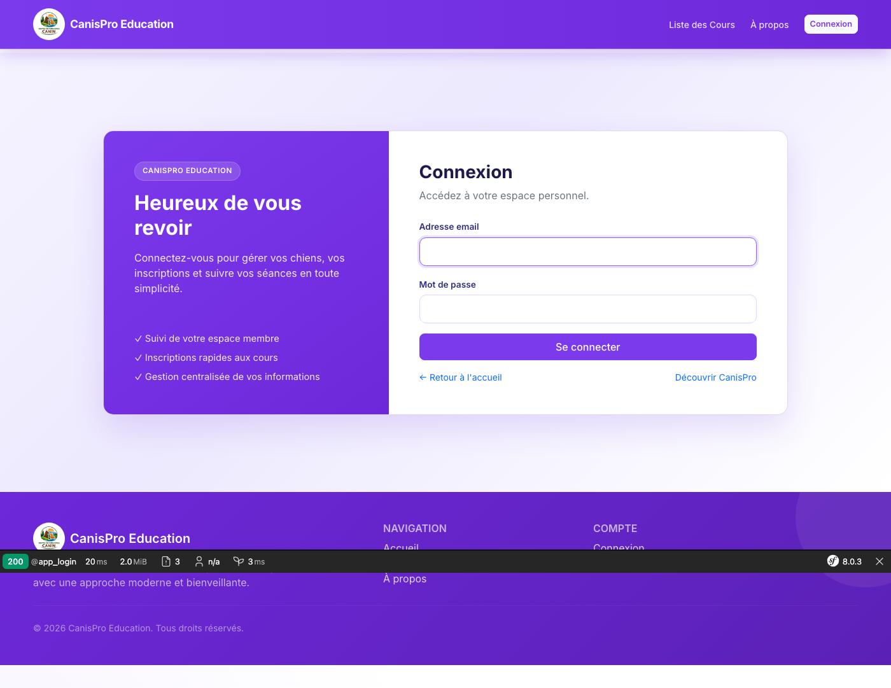
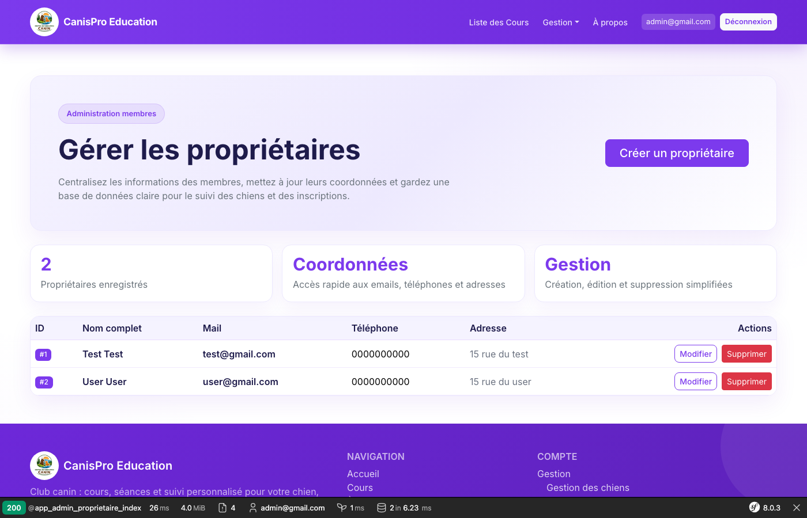
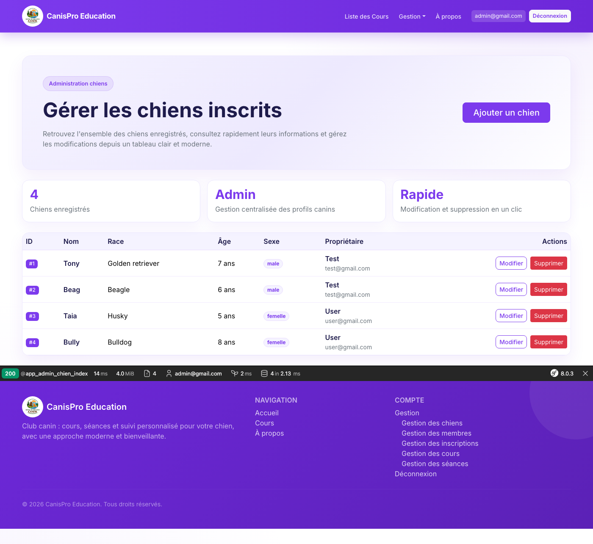
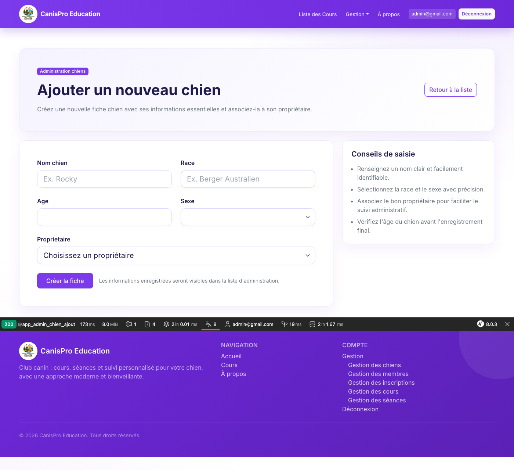
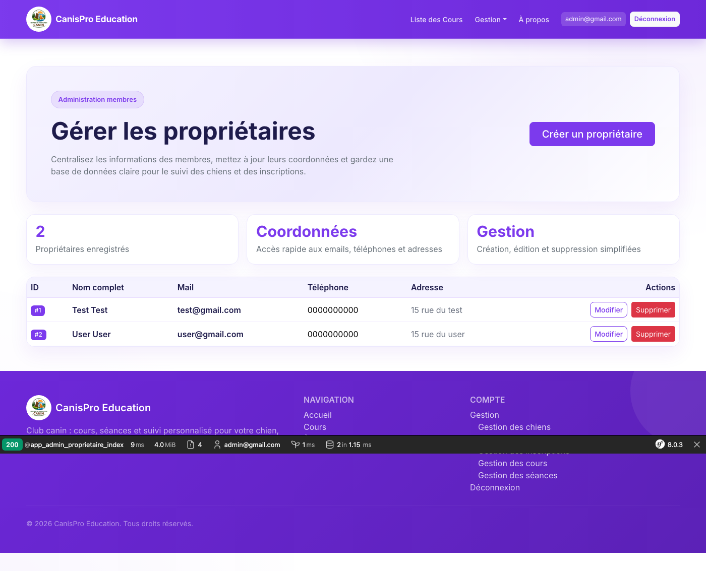
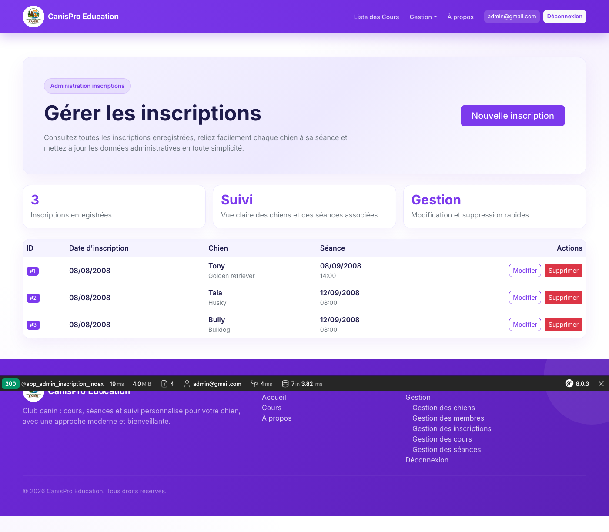
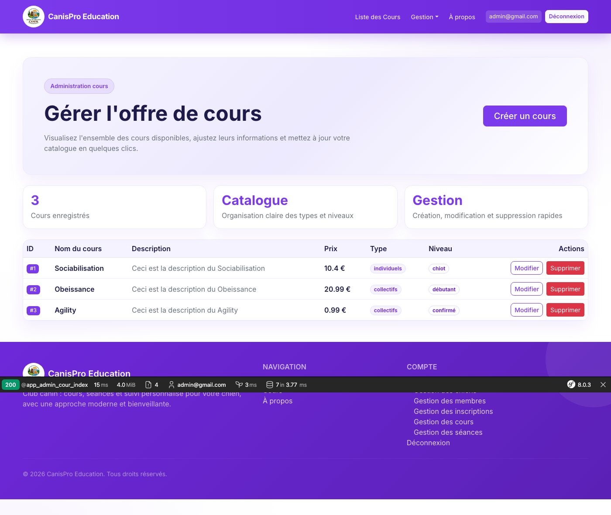
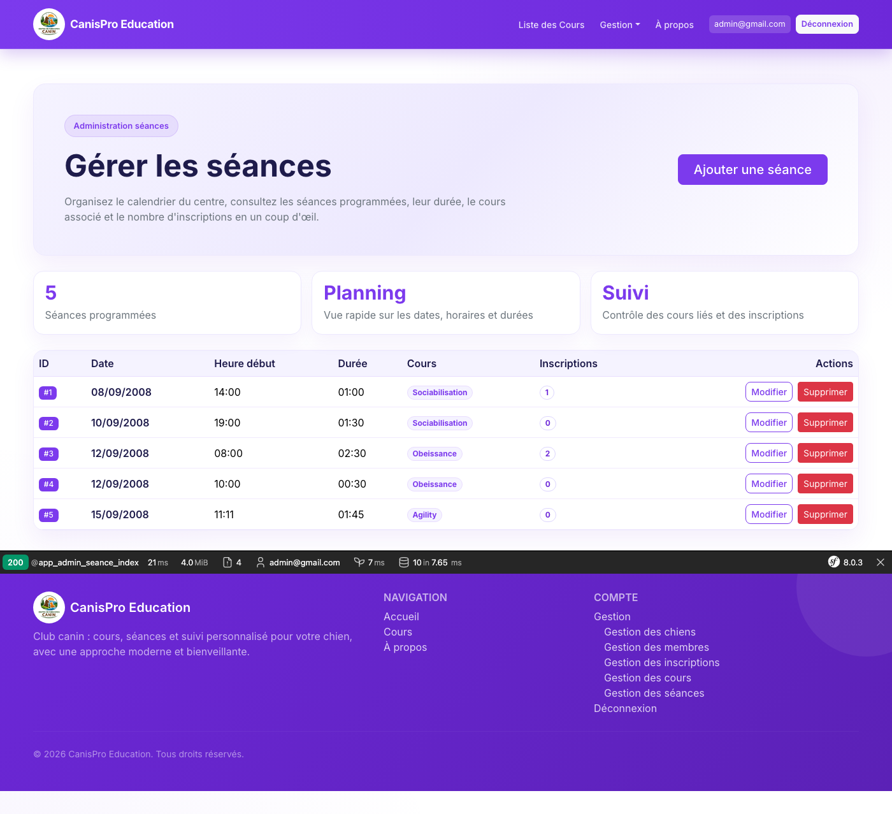

# CanisPro — Guide d’utilisation (espace administrateur)

Ce document est destiné à une **personne qui utilise le site au quotidien** (non développeur). Il décrit uniquement l’**interface d’administration**, avec des **captures d’écran** prises sur une instance locale en cours d’exécution.

**Langue de l’interface :** le site est en français ; ce guide l’est aussi.

---

## Sommaire

1. [Avant de commencer](#1-avant-de-commencer)
2. [Se connecter en administrateur](#2-se-connecter-en-administrateur)
3. [Ouvrir le menu « Gestion »](#3-ouvrir-le-menu-gestion)
4. [Gestion des chiens](#4-gestion-des-chiens)
5. [Gestion des membres (propriétaires)](#5-gestion-des-membres-propriétaires)
6. [Gestion des inscriptions](#6-gestion-des-inscriptions)
7. [Gestion des cours](#7-gestion-des-cours)
8. [Gestion des séances](#8-gestion-des-séances)
9. [Se déconnecter](#9-se-déconnecter)
10. [Annexe : régénérer les captures d’écran](#10-annexe--régénérer-les-captures-décran)

---

## 1. Avant de commencer

- L’application doit tourner **localement** (par exemple `http://127.0.0.1:8000`), comme lors de la prise des captures.
- Seuls les comptes ayant le rôle **administrateur** voient le menu **Gestion** et peuvent ouvrir les URLs commençant par `/admin/...`.
- **Compte de démonstration** (données chargées avec les *fixtures* du projet) :
  - **E-mail :** `admin@gmail.com`
  - **Mot de passe :** `admin`  
  **Important :** en production, utilisez un compte sécurisé et ne partagez jamais ce mot de passe.

> **Note visuelle :** en développement, une **barre grise Symfony** peut apparaître en bas de l’écran ; sur les captures ci-dessous elle est visible. Ce n’est pas un bug : elle disparaît en mode production.

---

## 2. Se connecter en administrateur

1. Ouvrez la page d’accueil du site, puis cliquez sur **Connexion** (menu en haut à droite), ou allez directement à l’adresse **`/login`** (ex. `http://127.0.0.1:8000/login`).
2. Saisissez l’**adresse e-mail** et le **mot de passe** du compte administrateur.
3. Cliquez sur **Se connecter**.

Après une connexion réussie, vous êtes renvoyé vers l’**accueil**. Vous devriez voir votre adresse e-mail dans la barre de navigation et le menu **Gestion**.



---

## 3. Ouvrir le menu « Gestion »

1. En haut de la page, repérez le lien **Gestion** (menu déroulant).
2. Cliquez sur **Gestion** : un menu s’ouvre avec les entrées suivantes :
   - **Gestion des chiens**
   - **Gestion des membres**
   - **Gestion des inscriptions**
   - **Gestion des cours**
   - **Gestion des séances**



Chaque entrée correspond à une section décrite ci-dessous. Vous pouvez aussi accéder directement aux adresses (à adapter selon votre hôte) :

| Section | Exemple d’URL locale |
|--------|------------------------|
| Chiens | `http://127.0.0.1:8000/admin/chien` |
| Membres | `http://127.0.0.1:8000/admin/proprietaire` |
| Inscriptions | `http://127.0.0.1:8000/admin/inscription` |
| Cours | `http://127.0.0.1:8000/admin/cour` |
| Séances | `http://127.0.0.1:8000/admin/seance` |

---

## 4. Gestion des chiens

**Rôle :** consulter tous les chiens enregistrés, en **ajouter**, les **modifier** ou les **supprimer**.



### Consulter la liste

- Le tableau affiche notamment : **ID**, **nom**, **race**, **âge**, **sexe**, **propriétaire** (nom et e-mail).

### Ajouter un chien

1. Cliquez sur **Ajouter un chien** (bouton en haut à droite de la page liste).
2. Remplissez le formulaire (race, nom, âge, sexe, propriétaire associé).
3. Validez pour enregistrer.



### Modifier ou supprimer

- **Modifier** : sur la ligne du chien, cliquez sur **Modifier**, ajustez les champs, puis enregistrez.
- **Supprimer** : cliquez sur **Supprimer**. Une **fenêtre de confirmation** du navigateur apparaît ; confirmez seulement si vous êtes sûr.

---

## 5. Gestion des membres (propriétaires)

**Rôle :** gérer les fiches **propriétaires** (membres) liées aux comptes utilisateurs : consultation, **ajout**, **modification**, **suppression**.



- Utilisez les boutons prévus sur la page (ajout, édition, suppression) en suivant les libellés à l’écran.
- La création d’un membre peut inclure la création ou l’association d’un **compte utilisateur** selon le formulaire affiché.

---

## 6. Gestion des inscriptions

**Rôle :** gérer les **inscriptions** d’un **chien** à une **séance** (date d’inscription, lien chien / séance).



- **Ajouter** : ouvrez le formulaire d’ajout, choisissez la séance et le chien concernés, puis validez.
- **Modifier** : ouvrez la fiche existante et mettez à jour les champs proposés.
- **Supprimer** : action destructive ; confirmez si le site vous le demande.

---

## 7. Gestion des cours

**Rôle :** gérer le **catalogue de cours** (nom, description, prix, type, niveau).



- **Créer un cours** : bouton principal sur la page liste, puis remplir le formulaire.
- **Modifier** : via l’action prévue sur chaque ligne (libellé du type **Modifier** ou équivalent).
- **Supprimer** : uniquement si vous acceptez de retirer ce cours du catalogue (attention aux séances liées).

---

## 8. Gestion des séances

**Rôle :** planifier les **séances** (date, heure de début, durée) et les rattacher à un **cours**.



- **Ajouter une séance** : formulaire avec choix du cours, date et horaires.
- **Modifier** / **Supprimer** : actions sur chaque ligne du tableau, avec confirmation lorsque la suppression est proposée.

---

## 9. Se déconnecter

1. En haut à droite, cliquez sur **Déconnexion** (à côté de votre adresse e-mail).
2. Vous revenez en navigation **non connectée** ; les pages `/admin/...` ne sont plus accessibles sans vous reconnecter avec un compte administrateur.

---

## 10. Annexe : régénérer les captures d’écran

Les images sont stockées dans le dossier **`docs/admin-manuel/`**. Pour les recréer après une mise à jour de l’interface :

1. Démarrez le site localement (ex. `php -S 127.0.0.1:8000 -t public` depuis la racine du projet).
2. Assurez-vous que la base contient le compte admin (ex. `php bin/console doctrine:fixtures:load` — **efface et recharge les données de démo**).
3. Depuis le dossier **`scripts/`** :
   ```bash
   npm install
   npx playwright install chromium
   node capture-admin-screens.mjs
   ```
   Variable optionnelle : `BASE_URL` (par défaut `http://127.0.0.1:8000`).

---

*Document généré pour CanisPro — guide utilisateur administrateur avec captures d’écran locales.*
